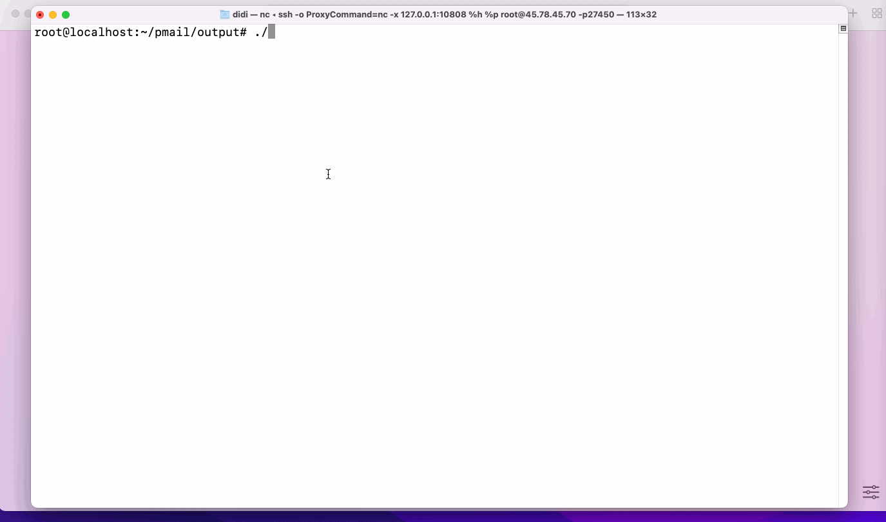

# PMail

> A server, a domain, a line of code, a minute, and you'll be able to build a domain mailbox of your own.

## [中文文档](./README_CN.md)

I'm Chinese and I'm not good at English, so I apologise for my translation.

## Introduction

PMail is a personal email server that pursues a minimal deployment process and extreme resource consumption. It runs on
a single file and contains complete send/receive mail service and web-side mail management functions. Just a server , a
domain name , a line of code , a minute of deployment time , you will be able to build a domain name mailbox of your
own .

All kinds of PR are welcome, whether you are fixing bugs, adding features, or optimizing translations. Also, call for a
beautiful and cute Logo for this project!



## Features

* Single file operation and easy deployment.

* The binary file is only 15MB and takes up less than 10M of memory during the run.

* Support dkim, spf checksum, [Email Test](https://www.mail-tester.com/) score 10 points if correctly configured.

* Implementing the ACME protocol, the program will automatically obtain and update Let's Encrypt certificates.

> By default, a ssl certificate is generated for the web service, allowing pages to use the https protocol.
> If you have your own gateway or don't need https, set `httpsEnabled` to `2` in the configuration file so that the web
> service will not use https.
(Note: Even if you don't need https, please make sure the path to the ssl certificate file is correct, although the web
> service doesn't use the certificate anymore, the smtp protocol still needs the certificate)

## Disadvantages

* At present, only the core function of sending and receiving emails has been completed. Basically, it can only be used
  by a single person, and does not deal with issues related to permission management in the process of multiple users.

* The UI is ugly

# How to run

## 1、Download

* [Click Here](https://github.com/Jinnrry/PMail/releases) Download a program file that matches you.

* Or use Docker `docker pull ghcr.io/jinnrry/pmail:latest`

## 2、Run

`./pmail` 

Or 

`docker run -p 25:25 -p 80:80 -p 443:443 -p 465:465 -v $(pwd)/config:/work/config ghcr.io/jinnrry/pmail:latest`

> [!IMPORTANT]
> If your server has a firewall turned on, you need to open ports 25, 80, and 443.

## 3、Configuration

Open `http://127.0.0.1` in your browser or use your server's public IP to visit, then follow the instructions to
configure.

## 4、Email Test

Check if your mailbox has completed all the security configuration. It is recommended to
use [https://www.mail-tester.com/](https://www.mail-tester.com/) for checking.

## 5、 WeChat Message Push

Open the `config/config.json` file in the run directory, edit a few configuration items at the beginning of `weChatPush`
and restart the service.

## 6、Telegram Message Push
Create bot and get token from [BotFather](https://t.me/BotFather)
Open the `config/config.json` file in the run directory, edit a few configuration items at the beginning of `tg`and restart the service.

# Configuration file format description

```json
{
  "logLevel": "info", //log output level
  "domain": "domain.com", // Your domain
  "webDomain": "mail.domain.com", // web domain
  "dkimPrivateKeyPath": "config/dkim/dkim.priv", // dkim key path
  "sslType": "0", // ssl certificate update mode, 0 automatic, 1 manual
  "SSLPrivateKeyPath": "config/ssl/private.key", // ssl certificate path
  "SSLPublicKeyPath": "config/ssl/public.crt", // ssl certificate path
  "dbDSN": "./config/pmail.db", // database connect DSN
  "dbType": "sqlite", //database type ，`sqlite` or `mysql`
  "httpsEnabled": 0, // enabled https , 0:enabled 1:enablde 2:disenabled
  "httpPort": 80, // http port . default 80
  "httpsPort": 443, // https port . default 443
  "spamFilterLevel": 0,// Spam filter level, 0: no filter, 1: filtering when `spf` and `dkim` don't pass, 2: filtering when `spf` don't pass
  "weChatPushAppId": "", // wechat appid
  "weChatPushSecret": "", // weChat  Secret
  "weChatPushTemplateId": "", // weChat TemplateId
  "weChatPushUserId": "", // weChat UserId
  "tgChatId": "", // telegram chatid
  "tgBotToken": "", // telegram  token
  "isInit": true // If false, it will enter the bootstrap process.
}
```


# For Developer

## Project Framework

1、 FE： vue3+element-plus

The code is in `fe` folder.

2、Server： golang + mysql

The code is in `server` folder.

## Api Documentation

[go to wiki](https://github.com/Jinnrry/PMail/wiki)

## Plugin Development

Reference this file. `server/hooks/wechat_push/wechat_push.go`
