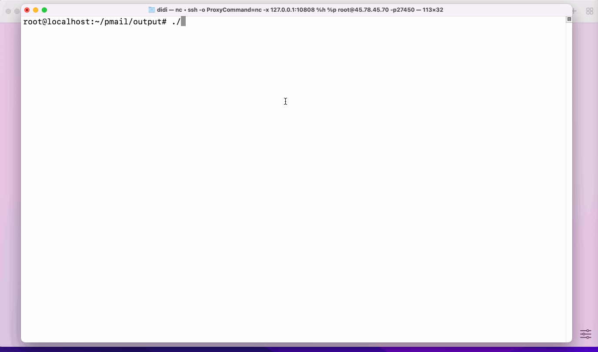

# PMail

> 一台服务器、一个域名、一行代码、一分钟时间，你就能够搭建出一个自己的域名邮箱。

PMail是一个追求极简部署流程、极致资源占用的个人域名邮箱服务器。单文件运行，包含完整的收发邮件服务和Web端邮件管理功能。只需一台服务器、一个域名、一行代码、一分钟部署时间，你就能够搭建出一个自己的域名邮箱。

欢迎各类PR，无论你是修复bug、新增功能、修改翻译。另外，也为这个项目征集一个漂亮可爱的Logo！



## 为什么写这个项目

迫于越来越多的邮件服务商暂停了针对个人的域名邮箱服务（比如QQ邮箱、微软Outlook邮箱），因此考虑自建域名邮箱服务。
但是自建域名邮箱可选的程序并不多，且目标都不是针对个人使用场景设计的。个人服务器一般内存、CPU、硬盘配置都不高，针对公司场景使用的邮箱程序过于臃肿，
白白浪费资源。就拿我自己的服务器来说，我服务器配置为1核512M 10G硬盘，市面上绝大多数邮箱服务器安装上就把磁盘占满了，根本没法正常使用

## 项目优势

### 1、部署简单

使用Go语言编写，支持跨平台，编译后单文件运行，单文件包含完整的前后端代码。修改配置文件，运行即可。

### 2、资源占用极小

编译后二进制文件仅15MB，运行过程中占用内存10M以内。

### 3、安全方面

支持dkim、spf校验。正确配置的情况下，Email Test得分10分。

### 4、自动SSL证书

实现了ACME协议，程序将自动获取并更新Let’s Encrypt证书。

默认情况下，会为web后台也生成ssl证书，让后台使用https访问，如果你有自己的网关层，不需要https的话，在配置文件中将`httpsEnabled`
设置为`2`，这样管理后台就不会使用https协议。（ 注意：即使你不需要https，也请保证ssl证书文件路径正确，http协议虽然不使用证书了，但是smtp协议还需要证书）

### 5、邮件客户端支持

只要支持pop3、smtp协议的邮件客户端均可使用

## 其他

### 不足

1、目前只完成了最核心的收发邮件功能。基本上仅针对单人使用，没有处理多人使用、权限管理相关问题。

2、前端UI交互较差

# 如何部署

## 0、检查IP、域名

先去[spamhaus](https://check.spamhaus.org/)检查你的域名和服务器IP是否有屏蔽记录

## 1、下载文件

* [点击这里](https://github.com/Jinnrry/PMail/releases)下载一个与你匹配的程序文件。

* 或者使用Docker运行 `docker pull ghcr.io/jinnrry/pmail:latest`

## 2、运行

`./pmail` 

或者

`docker run -p 25:25 -p 80:80 -p 443:443 -p 110:110 -p 465:465 -v $(pwd)/config:/work/config ghcr.io/jinnrry/pmail:latest`

> [!IMPORTANT]
> 如果你服务器开启了防火墙，你需要放行25、80、110、443、465这五个端口

## 3、配置

浏览器打开 `http://127.0.0.1` 或者是用你服务器公网IP访问，然后按提示配置

## 4、邮箱得分测试

建议找一下邮箱测试服务(比如[https://www.mail-tester.com/](https://www.mail-tester.com/))进行邮件得分检测，避免自己某些步骤漏配，导致发件进对方垃圾箱。

## 5、微信推送

打开运行目录下的 `config/config.json`文件，编辑 `weChatPush` 开头的几个配置项，重启服务即可。

## 6、Telegram推送
从 [BotFather](https://t.me/BotFather) 创建并获取令牌机器人。 打开运行目录下的 config/config.json 文件，编辑 `tg` 开头的几个配置项，重启服务即可。


# 配置文件说明

```json
{
  "logLevel": "info", //日志输出级别
  "domain": "domain.com", // 你的域名
  "webDomain": "mail.domain.com", // web域名
  "dkimPrivateKeyPath": "config/dkim/dkim.priv", // dkim 私钥地址
  "sslType": "0", // ssl证书更新模式，0自动，1手动
  "SSLPrivateKeyPath": "config/ssl/private.key", // ssl 证书地址
  "SSLPublicKeyPath": "config/ssl/public.crt", // ssl 证书地址
  "dbDSN": "./config/pmail.db", // 数据库连接DSN
  "dbType": "sqlite", //数据库类型，支持sqlite 和 mysql
  "httpsEnabled": 0, // web后台是否启用https 0默认（启用），1启用，2不启用
  "spamFilterLevel": 0,// 垃圾邮件过滤级别，0不过滤、1 spf dkim 校验均失败时过滤，2 spf校验不通过时过滤
  "httpPort": 80, // http 端口 . 默认 80
  "httpsPort": 443, // https 端口 . 默认 443
  "weChatPushAppId": "", // 微信推送appid
  "weChatPushSecret": "", // 微信推送秘钥
  "weChatPushTemplateId": "", // 微信推送模板id
  "weChatPushUserId": "", // 微信推送用户id
  "tgChatId": "", // telegram 推送chatid
  "tgBotToken": "", // telegram 推送 token
  "isInit": true // 为false的时候会进入安装引导流程 
}
```

# 第三方邮件客户端配置

POP3地址： [你的域名]

POP3端口： 110/995(SSL)

SMTP地址： smtp.[你的域名]

SMTP端口： 25/465(SSL)

# 参与开发

## 项目架构

1、前端： vue3+element-plus

前端代码位于`fe`目录中，运行参考`fe`目录中的README文件

2、后端： golang + mysql

后端代码进入`server`文件夹，运行`main.go`文件

## 后端接口文档

[参见Wiki](https://github.com/Jinnrry/PMail/wiki)

## 插件开发

参考微信推送插件`server/hooks/wechat_push/wechat_push.go`

